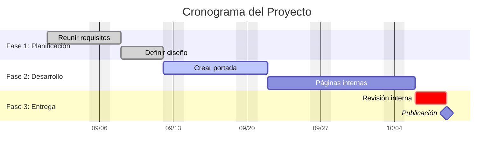

```mermaid
gantt
    title Cronograma del Proyecto
    dateFormat YYYY-MM-DD
    axisFormat %m/%d
    excludes weekends

    section Fase 1: Planificación
    Reunir requisitos :done, req, 2026-09-01, 5d
    Definir diseño     :done, des, after req, 4d

    section Fase 2: Desarrollo
    Crear portada      :active, top, 2026-09-12, 7d
    Páginas internas   :sub, after top, 10d

    section Fase 3: Entrega
    Revisión interna   :crit, rev, after sub, 3d
    Publicación        :milestone, m1, after rev, 0d
```
